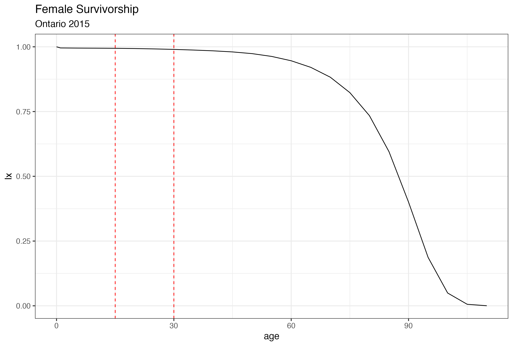

# life-tables

## Run this repository in a web browser using Binder. Push the button >> 

## Creating Model Life Tables

Life tables are a fundamental tool in demography. They are useful to compare populations. In the life table, each column represents a different measure of survivorship, encompassing various descriptors like the probability of still being alive, life expectancy, and more. Here, we explain the main columns of a life table and demonstrate how to construct a life table in R using the tidyverse syntax.

